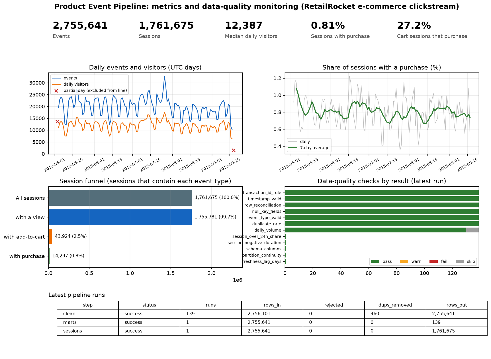

# Product Event Data Pipeline with Data-Quality Monitoring

A small, complete data pipeline for product event data: ingest raw events, validate and clean them, derive sessions,
build product-metric tables, monitor data quality, and report results. Built on a real e-commerce clickstream
(2.76M events) with Python, SQL, DuckDB and Parquet, and tested by injecting known faults.



## Data
[RetailRocket e-commerce dataset](https://www.kaggle.com/datasets/retailrocket/ecommerce-dataset) (Kaggle), `events.csv` only:
visitor events (`view`, `addtocart`, `transaction`) from an online retailer, 2015-05-03 to 2015-09-18 (UTC).
Real data, not simulated. It is an e-commerce clickstream, not SaaS product telemetry. The file is not committed; see "How to run".

## Architecture
```
events.csv
   |  ingest_raw.py     typed columns, partitioned by event date, row-count reconciliation
   v
raw layer        data/lake/raw/event_date=YYYY-MM-DD/*.parquet      (nothing dropped)
   |  clean.py          validate, quarantine bad rows, drop exact duplicates, deterministic event_id
   v
clean layer      clean_events, quarantine_events                    (incremental, idempotent per day)
   |  build_marts.py    30-minute sessionization, metric tables
   v
marts            events_sessionized, sessions, daily_metrics, item_summary
   |  quality_checks.py 12 checks, results stored per run, non-zero exit on critical failure
   v
monitoring       dq_results, pipeline_runs
   |  build_report.py
   v
report           reports/dashboard.png, reports/summary.md
```

## Results on the real data
| Stage | Result |
|---|---|
| Raw layer | 2,756,101 events in 139 daily partitions; row counts reconcile with the CSV |
| Clean layer | 0 rows rejected; 460 exact duplicates removed (366 add-to-cart, 94 view, 0 transaction); 2,755,641 rows out |
| Idempotency | Re-running the clean layer leaves row count (2,755,641) and content checksum unchanged |
| Sessions | 1,761,675 sessions from 1,407,580 visitors; median session has 1 event; 78.3% are single-event sessions |
| Product metrics | Median 12,387 daily visitors (137 full days); 0.81% of sessions contain a purchase; 27.2% of sessions with an add-to-cart also contain a purchase |
| Monitoring | 978 check executions on the real data: 0 failures, 0 warnings, 9 skipped (partial first and last day, and the first 7 days without enough history for the volume baseline) |

The first and last UTC days are partial days in the source, so they are flagged and excluded from volume checks.
Daily cart-to-purchase rates are noisy because a typical day has only a few hundred cart sessions.

## Data-quality checks
| Severity | Checks |
|---|---|
| Critical (fail and stop) | schema and types, null key fields, valid event types, timestamp range and partition-date match, row reconciliation (raw = clean + quarantined + duplicates), non-negative session duration |
| Warning | transaction_id rule, duplicate rate, daily volume vs trailing 14-day median, partition gaps, freshness, sessions longer than 24h |

Rules are pure functions over DataFrames (`src/dq_rules.py`), so they are unit-tested without a database.

## Does the monitoring work? Fault injection
A clean run proves little, so `src/run_fault_test.py` builds an isolated copy of 30 real days, corrupts it in eight known ways,
runs the whole pipeline on it, and compares the alerts with an answer key. The real data is never modified.

| Injected fault | Alert |
|---|---|
| 2% of rows duplicated | duplicate_rate: warn |
| Unknown event type | event_type_valid: fail |
| Null item_id | null_key_fields: fail |
| Late-arriving events (3 days old) | timestamp_valid: fail |
| Transactions without transaction_id | transaction_id_rule: warn |
| Volume dropped to about 20% | daily_volume: warn |
| Missing daily partition | partition_continuity: warn |
| Implausible timestamp (year 1999) | timestamp_valid: fail |

Result: 8 of 8 detected, 0 unexpected alerts, and the quality gate stopped the pipeline (non-zero exit).
The first run showed one unexpected alert. The cause was the test, not the check: the event-type fault had relabeled a
transaction row, which also broke the transaction_id rule. The injection was fixed to isolate each fault; the check was not loosened.

## Tests
17 automated tests (`python3 -m pytest tests -v`): data-quality rules, sessionization on hand-built cases (30-minute boundary,
sessions that cross midnight), clean-layer validation, deduplication, deterministic IDs and idempotency.

## Design decisions
- **Incremental by date for raw and clean.** Identical rows share a timestamp, so they always land in the same partition and per-partition deduplication is sufficient.
- **Deduplication key includes the item.** One order with several items produces several rows with the same transaction id; those are not duplicates.
- **Sessions and marts are rebuilt in full.** Sessions can cross midnight UTC, so a per-day build would split them. This is cheap at this size.
- **Quarantine, do not delete.** Rejected rows keep a reason in `quarantine_events`.
- **Every step is logged** in `pipeline_runs` with rows in, rejected, duplicates removed, rows out, status and error.

## Limitations
- Single-machine batch processing (DuckDB and Parquet). No streaming system, orchestrator or cloud platform was used, and about 2.8M events is not large scale.
- The freshness check is simulated: the source is a static historical dataset, so freshness is judged against an as-of date.
- Schema drift is covered by a unit test but not demonstrated end to end on injected files.
- Thresholds (duplicate rate, volume ratio, long sessions) were set heuristically and not tuned on historical alerts.
- The cause of the duplicate events (concentrated in add-to-cart) is unknown from this data.

## If this had to scale (design notes only, not implemented)
Move storage to an object store with a table format, process days incrementally with a lookback window for sessions,
schedule steps with an orchestrator, and alert on the monitoring tables instead of reading a report.

## How to run
```bash
python3 -m venv .venv && source .venv/bin/activate
python3 -m pip install -r requirements.txt
# download events.csv from the Kaggle link above and save it as data/raw/events.csv
python3 src/profile_events.py     # profile the source file
python3 src/ingest_raw.py         # raw layer
python3 src/clean.py              # clean layer (run twice to see the idempotency check)
python3 src/build_marts.py        # sessions and metric tables
python3 src/quality_checks.py     # monitoring (non-zero exit on critical failure)
python3 src/build_report.py       # dashboard and summary
python3 src/run_fault_test.py     # fault injection test
python3 -m pytest tests -v
```

## Repository layout
```
src/       pipeline code, data-quality rules, fault injection, report builder
sql/       schema, cleaning, sessionization, marts, data-quality metrics
tests/     unit tests
docs/      DESIGN.md (design and findings at each step)
reports/   data profile, data-quality report, fault-injection results, dashboard
```
